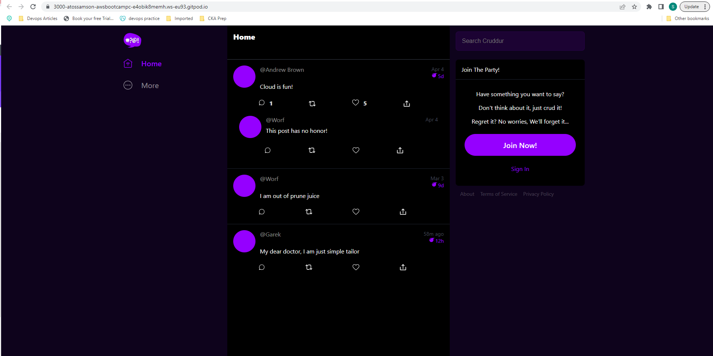
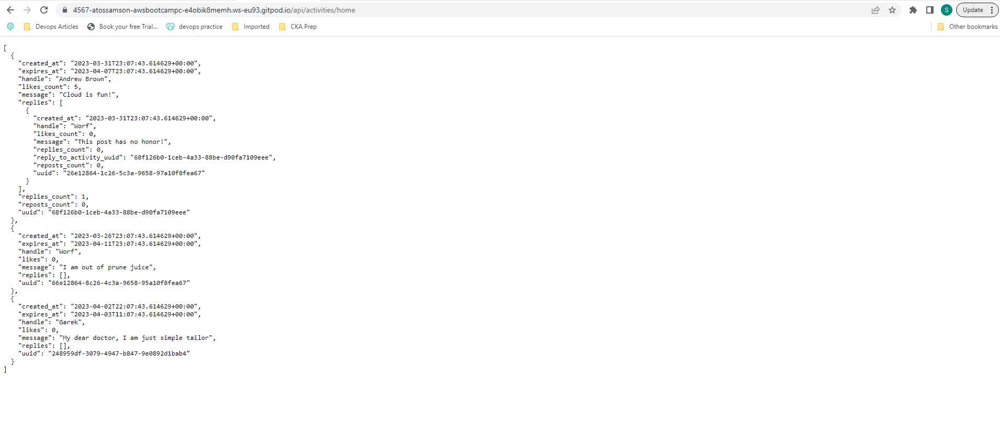

# Week 1 — App Containerization

## Required Homework/Tasks

Configure Gitpod.yml configuration.

### Ensure we can get the apps running locally
This task has been done.

### Write a Dockerfile for each app
This has been completed as shown in the code base

### Ensure we get the apps running via individual container

### Frontend is up and running!

### Backend is up and running!

### Create a docker-compose file
This task has been done as shown in the code base

### Ensure we can orchestrate multiple containers to run side by side
This task has been done as shown in the code base with the docker-compose.yml

